# Система для планування корпоративних заходів

Склад команди: [Богдан Пелех](https://github.com/Bohdan213), [Федір Журба](https://github.com/fazhur), [Максим Михасюта](https://github.com/maxmyk), [Роман Берніков](https://github.com/romberol)

## Основний функціонал:
- Створення/видалення користувачів
- Створення/видалення груп
- Створення/скасування подій
- Оповіщення користувача про вищеперераховані дії

Загальна інформація про конфігурації та стан системи зберігається та передається за допомогою Consul. Система дозволяє дублювання facade, communication сервіси взаємодіють з іншими сервісами за допомогою Hazelcast черги, що дозволяє дублювання цього сервісу для підвищення швидкодії та надійності системи. MongoDB для planning сервіса реплікується, що забезпечує відмовостійкість. Facade сервіс виступає у ролі API Gateway, з яким безпосередньо взаємодіє користувач.

## User-management
User-management розроблений для виконання різноманітних операцій, пов’язаних з управлінням користувачами та групами в системі. Його функціональність включає автентифікацію користувачів, створення груп, додавання користувачів до груп та операції видалення, що робить його універсальним для широкого спектру завдань управління користувачами.

### Мета сервісу:
Основна мета цього сервісу полягає в наступному:
- Автентифікація користувачів: перевірка даних користувачів та надання токенів, які можуть бути використані для авторизації подальших запитів.
- Управління групами: створення нових груп з вказаними членами та надання функціональності для управління цими групами (додавання чи видалення членів).
- Управління користувачами: підтримка додавання користувачів з докладними атрибутами (наприклад, ім'я користувача, пароль, електронна пошта) та перевірка їхнього існування в системі.
- Операції видалення: забезпечує видалення користувачів і груп безпечно та гарантує, що зв’язана інформація зберігається.

### Взаємодія з реляційною базою даних:
Сервіс взаємодіє з реляційною базою даних для збереження та отримання даних, пов’язаних з користувачами та групами. Це включає:
- Дані користувачів: зберігання даних про облікові записи користувачів, профілі та інформацію про сесії. Токени користувачів, що генеруються під час автентифікації, ймовірно, пов'язані з даними сесій, які зберігаються в базі даних.
- Дані груп: підтримує записи про групи, включаючи деталі їх членства та будь-які метадані, пов’язані з цими групами.
- Цілісність транзакцій: забезпечує, що всі операції, пов'язані з управлінням користувачами та групами, виконуються коректно.

## Planning
Planning service дозволяє користувачам створювати, скасовувати та переглядати події. Він має такі основні функції:

1. **Створення події**: користувачі можуть створювати нові події, надаючи такі деталі, як опис події, список учасників, назва групи, час та назва. Служба взаємодіє з базою даних MongoDB для зберігання інформації та генерує унікальний ідентифікатор події.

2. **Скасування подій**: користувачі можуть скасувати існуючі події, які вони створили. Сервіс перевіряє дозвіл користувача на скасування події та видаляє її з бази даних, якщо користувач авторизований.

3. **Перегляд подій**: сервіс надає функціональність для отримання подій на основі різних критеріїв:
    - Перегляд подій, пов'язані з конкретним користувачем.
    - Перегляд подій, пов'язані з певною групою.

4. **Отримання інформації про подію**: служба може отримати детальну інформацію про конкретну подію, включаючи опис, список учасників, назву групи, час та назву.

5. **Інтеграція черги повідомлень**: коли подія створюється або скасовується, сервіс генерує об’єкт запиту, що містить інформацію про подію, і поміщає його в чергу повідомлень. Цей механізм полегшує доставку сповіщень до інших компонентів або служб у системі.

## Communication
Комунікація з сервісами User-management та Planning здійснюється через асинхронну чергу повідомлень, реалізовану за допомогою Hazelcast. Доступ до черги налаштовується за допомогою Consul. Кожен елемент черги представляє собою об'єкт класу Request, який містить наступну інформацію:
- Сервіс, що надіслав запит
- Тип запиту
- Додаткові необхідні дані

Для обробки цих запитів використовується клас CommunicationService, який забезпечує наступні функції:

1. **Старт сервісу**: Метод `start` запускає сервіс, ініціюючи процес читання черги.
2. **Надсилання електронних листів про додавання до групи**: Метод `send_group_addition_email` надсилає користувачам електронні листи про додавання до вказаної групи.
3. **Надсилання електронних листів про видалення з групи**: Метод `send_group_removal_email` інформує користувачів про їх видалення з вказаної групи.
4. **Надсилання запрошень на події**: Метод `send_event_invitation_email` надсилає запрошення на події з зазначенням назви події та часу.
5. **Надсилання повідомлень про скасування подій**: Метод `send_event_cancellation_email` інформує користувачів про скасування події.

Клас `QueueReader` читає повідомлення з черги Hazelcast і зберігає їх у пам'яті. Метод `parse_memory` класу CommunicationService обробляє ці запити відповідно до їх типу:
- Для запитів з сервісу `user_management`:
  - `group_addition`: Надсилаються електронні листи про додавання до групи.
  - `group_removal`: Надсилаються електронні листи про видалення з групи.
- Для запитів з сервісу `planning`:
  - `event_invitation`: Надсилаються запрошення на події.
  - `event_cancellation`: Надсилаються повідомлення про скасування подій.

Конфігурація Hazelcast отримується за допомогою клієнта Consul. Метод `get_config` отримує конфігурацію з Consul для зазначеного імені конфігурації, а `get_client` створює клієнт Hazelcast на основі цієї конфігурації.

Запуск сервісу здійснюється за допомогою сценарію, який виконується під час старту. Він реєструє сервіс у Consul, отримує конфігурацію Hazelcast, створює клієнта Hazelcast і запускає сервіс комунікації у окремому потоці. Запити обробляються у циклі методом `parse_memory`.

## Facade
Клас FacadeService забезпечує взаємодію між користувачами та різними сервісами через REST API. Він підтримує створення, читання, оновлення та видалення даних, пов'язаних з користувачами, групами та подіями.

- **Аутентифікація користувачів**: Метод GET з параметром authenticate аутентифікує користувачів на основі їх імені користувача та паролю, надсилаючи запити до User-management сервісів.
- **Робота з групами**: Методи POST, GET та DELETE дозволяють створювати групи, додавати користувачів до груп, видаляти користувачів з груп, а також отримувати інформацію про користувачів у групі, надсилаючи запити до User-management сервісів.
- **Робота з подіями**: Методи POST та DELETE дозволяють створювати події та скасовувати їх. Також доступні методи для перегляду подій за користувачем, групою або творцем події, надсилаючи запити до Planning сервісу.
- **Управління користувачами**: Методи POST та DELETE дозволяють створювати користувачів та видаляти їх.

Клас PostService реалізує методи для створення та оновлення даних у сервісах User-management та Planning. Всі запити до цих сервісів здійснюються через функцію get_random_url, яка вибирає випадковий доступний URL для цільового сервісу.

Клас GetService реалізує методи для отримання даних з сервісів User-management та Planning, включаючи аутентифікацію користувачів, отримання списків користувачів у групі, перевірку існування користувача та перегляд подій.

Клас DeleteService реалізує методи для видалення користувачів та груп у сервісі User-management, а також скасування подій у сервісі Planning.

Конфігурація та підключення до Hazelcast здійснюються через методи get_config та get_client.

## **Приклади роботи програми**:
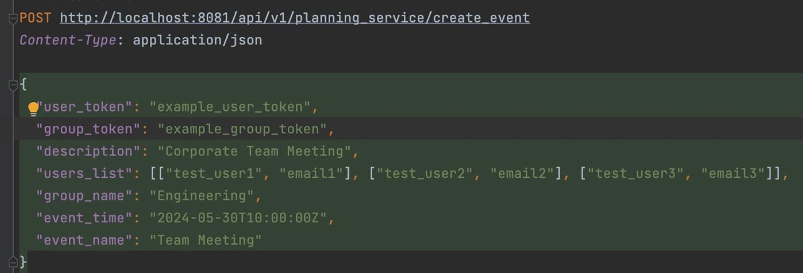
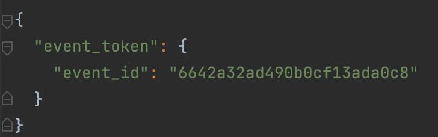
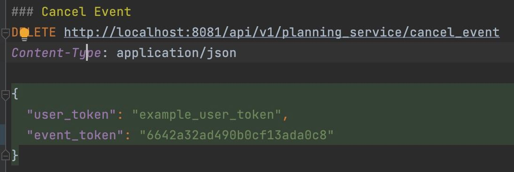
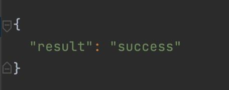
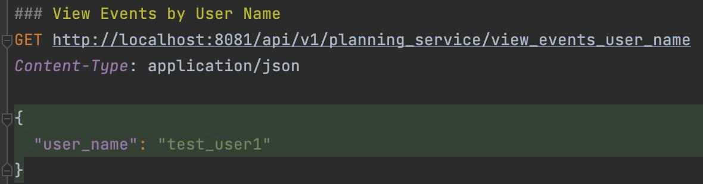
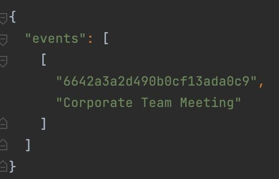
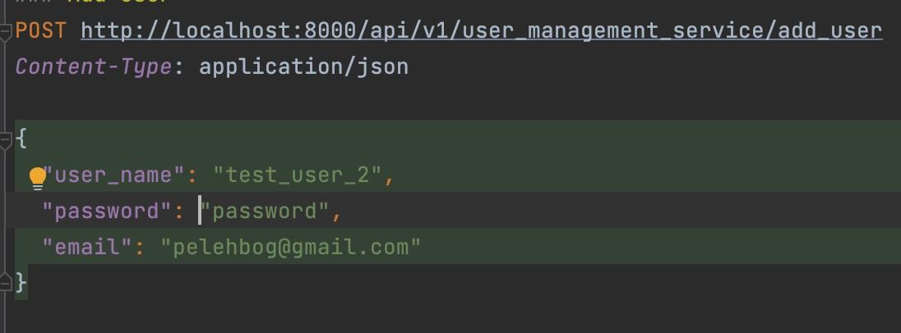
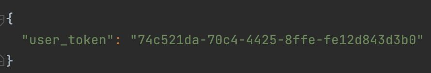
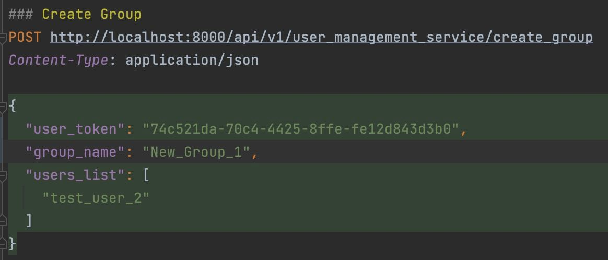
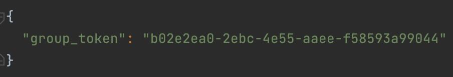
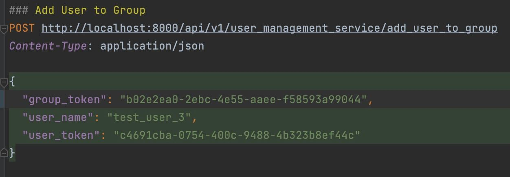
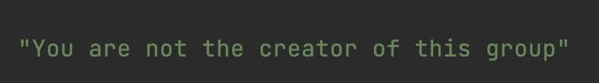
